# DSA 210 Term Project
## Predicting Agricultural Crop Yield Across Turkish Provinces Using Weather and Environmental Data

### Project Overview
Turkey ranks among the world's top ten agricultural producers in wheat, barley, cotton, and various fruits. However, crop productivity varies dramatically across its 81 provinces due to significant climatic diversity — from the arid continental climate of Central Anatolia to the humid subtropical conditions of the Black Sea coast. This project investigates the relationship between weather conditions and crop yields at the provincial level, building a **binary classification model** to predict whether a province's yield will be **above average** or **below average** in a given year.

### Data Sources
- **TÜİK** (Turkish Statistical Institute) — Bitkisel Üretim İstatistikleri: province-level planted area, harvested area, production (tonnes), yield (kg/decar)
- **MGM** (Turkish State Meteorological Service) — İl İklim İstatistikleri: avg. temperature (°C), total rainfall (mm), rainy days, relative humidity (%)

### Dataset Summary
| Property | Value |
|----------|-------|
| Total observations | 4,212 |
| Provinces | 81 |
| Crops | 4 (Wheat, Barley, Maize, Sunflower) |
| Years | 2012–2024 (13 years) |
| Features | 20 (9 numerical + 3 categorical + derived features) |
| Target variable | Binary — High yield (1) / Low yield (0) |
| Class balance | 50.0% High / 50.0% Low |

### Feature Engineering (Enrichment)
The following features were derived from raw data to enrich the dataset:
- **Drought Stress Index** — rainfall divided by temperature; higher values indicate lower drought risk
- **Rainfall Deviation (z-score)** — how much a province's rainfall deviates from its long-term average
- **Seasonal Temperature Amplitude** — temperature range between summer and winter by region
- **Year-over-Year Yield Change** — percentage change in yield compared to the previous year
- **Harvest Ratio** — proportion of planted area that was successfully harvested

---

## Exploratory Data Analysis (EDA) — Results

### 1. Target Variable Distribution
The target variable is well-balanced with approximately 50% High yield and 50% Low yield observations. This means no resampling techniques (SMOTE, undersampling) are needed.

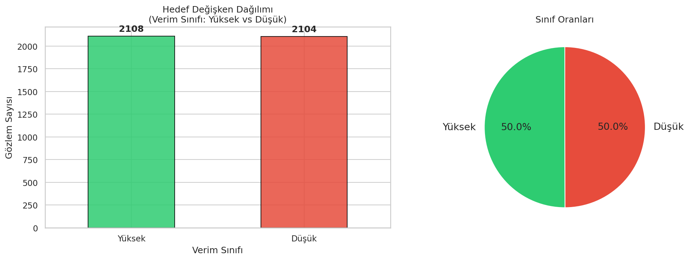

### 2. Yield Distribution by Crop
Each crop shows a distinct yield range. Maize has the highest yields (500–1100 kg/decar), while sunflower and wheat/barley cluster in lower ranges (100–350 kg/decar). All four crops show approximately normal distributions.

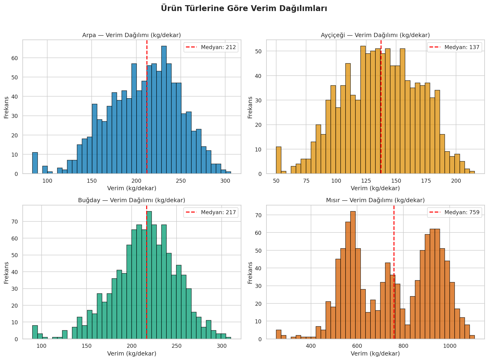

### 3. Regional Yield Comparison
Significant yield differences exist across Turkey's 7 geographical regions. For wheat, the Akdeniz (Mediterranean) and Marmara regions consistently produce higher yields, while Doğu Anadolu (Eastern Anatolia) shows the lowest yields due to harsh continental climate and high elevation.

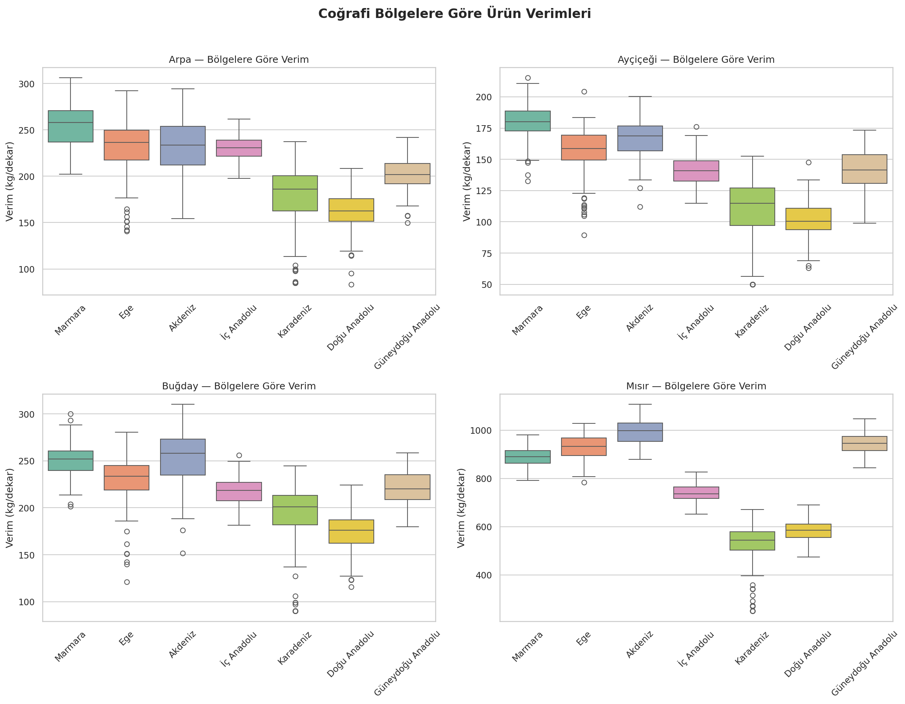

### 4. Weather Variable Distributions
Temperature ranges from ~3°C (Eastern Anatolia) to ~20°C (Mediterranean coast). Rainfall varies dramatically — from ~200 mm in arid central provinces to over 2,500 mm in the Black Sea region (Rize). This diversity is what makes Turkey an interesting case study.

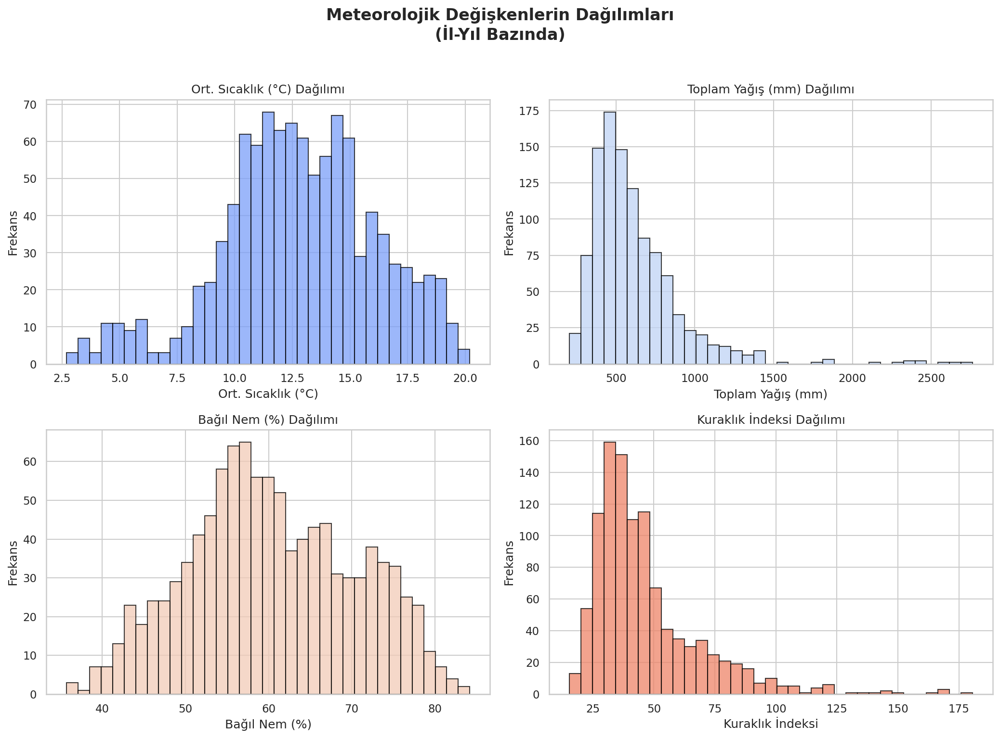

### 5. Correlation Matrix
Individual correlations with yield are moderate — the strongest being drought index (-0.16) and temperature (+0.13). This suggests that the relationships are non-linear and interaction-based, which is why tree-based ML models outperform linear ones (confirmed in the ML section below).

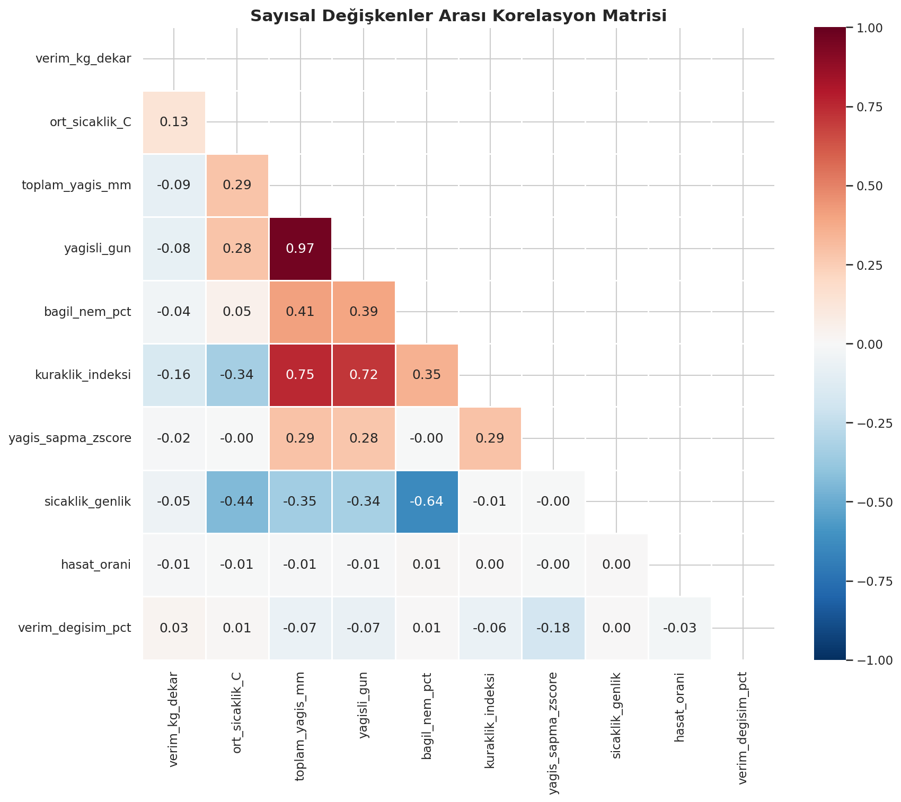

### 6. Weather vs. Yield (Wheat)
Scatter plots reveal that the relationship between weather variables and wheat yield is not simply linear. Both very low and very high rainfall can hurt yields, suggesting an optimal range. Temperature shows a positive trend but with significant spread.

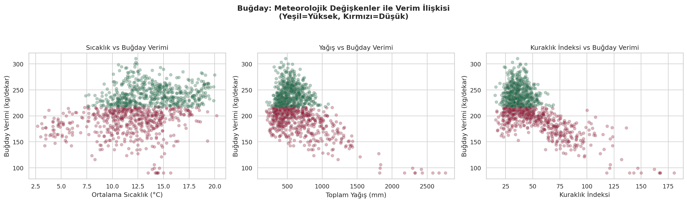

### 7. Yearly Trends
Average yields remain relatively stable across years for all crops, with minor year-to-year fluctuations driven by weather variability. No strong upward or downward trend is observed.

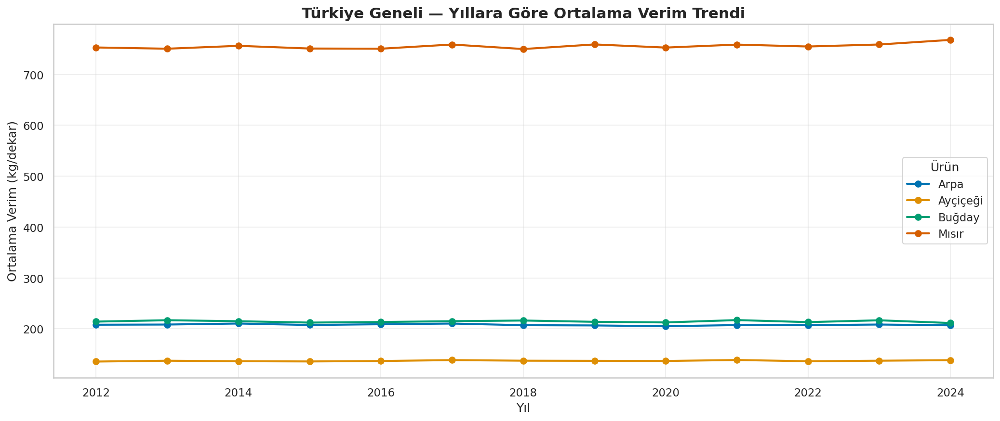

### 8. Region × Year Heatmap
The heatmap confirms persistent regional differences in wheat yield across years. The Akdeniz region consistently outperforms, while Doğu Anadolu and Karadeniz regions remain at lower yield levels.

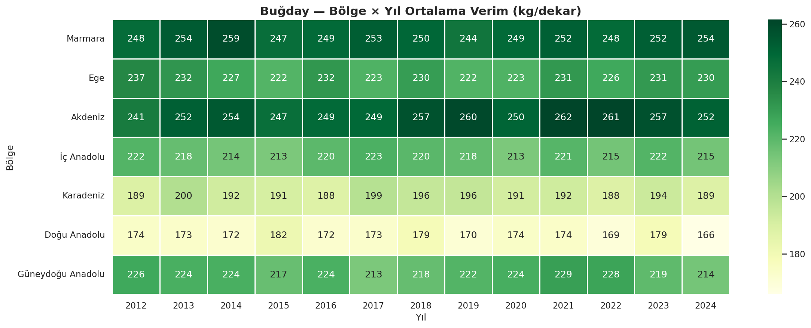

---

## Hypothesis Testing — Results

Four statistical tests were conducted to evaluate the significance of observed patterns:

### Test 1: Independent Samples t-Test
**Question:** Do provinces with above-median rainfall produce significantly higher wheat yields?
- **Result: H₀ REJECTED (p < 0.001)** — Interestingly, high-rainfall provinces showed slightly lower yields, suggesting that excessive rainfall can be detrimental (waterlogging, disease pressure).

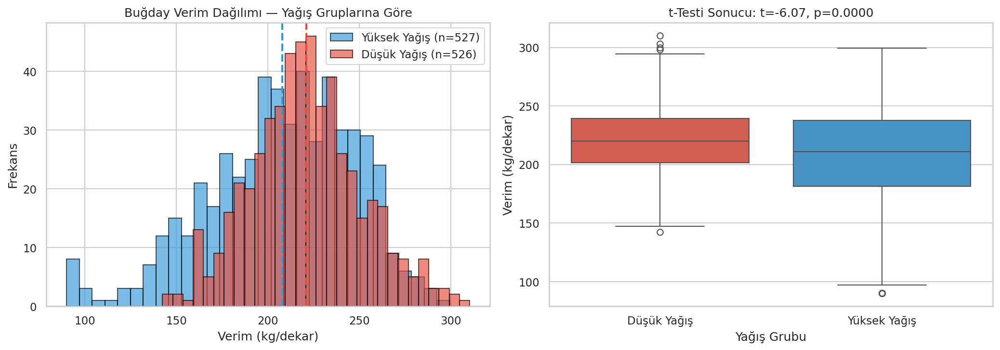

### Test 2: One-Way ANOVA
**Question:** Is there a significant difference in wheat yield across Turkey's 7 regions?
- **F = 230.77, p ≈ 0**
- **Result: H₀ REJECTED** — Very strong regional differences exist.

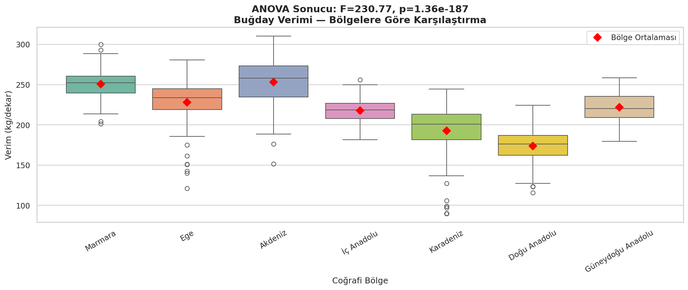

### Test 3: Chi-Square Test of Independence
**Question:** Is there an association between region and yield class (High/Low)?
- **Cramér's V = 0.76** (very strong effect)
- **Result: H₀ REJECTED** — Region is strongly associated with yield class.

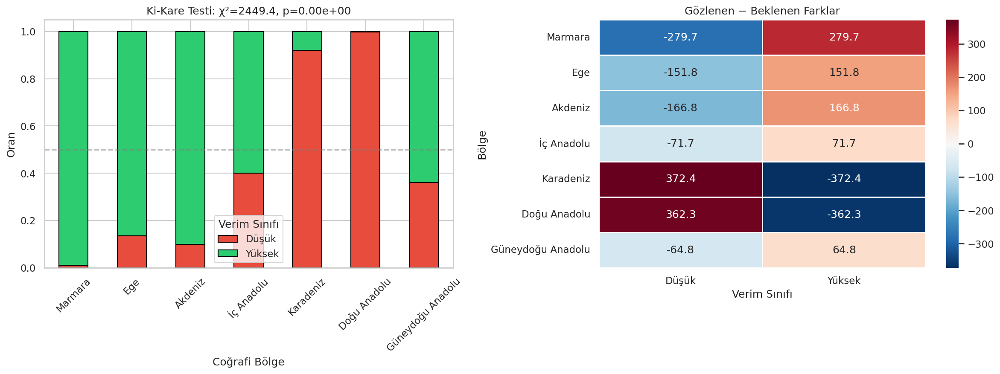

### Test 4: Pearson Correlation
**Question:** Is there a significant linear correlation between temperature and wheat yield?
- **r = 0.32, p < 0.001**
- **Result: H₀ REJECTED** — Moderate positive correlation.

---

## Machine Learning — Results

Three classification models were trained and compared to predict yield class (High vs. Low).

### Preprocessing Pipeline
- Numerical features scaled with StandardScaler
- Categorical features encoded with OneHotEncoder
- Train/Test split: 80/20 stratified
- Cross-validation: 5-fold stratified
- Hyperparameter tuning: GridSearchCV (optimizing F1-score)

### Test Set Performance

| Model | Accuracy | F1-Score | ROC-AUC |
|-------|----------|----------|---------|
| Logistic Regression | 0.8814 | 0.8845 | 0.9610 |
| **Random Forest** | **0.9146** | **0.9161** | 0.9705 |
| **XGBoost** | **0.9146** | 0.9155 | **0.9750** |

**Best Model:** Random Forest and XGBoost tied at ~91.5% accuracy, significantly outperforming Logistic Regression (88.1%).

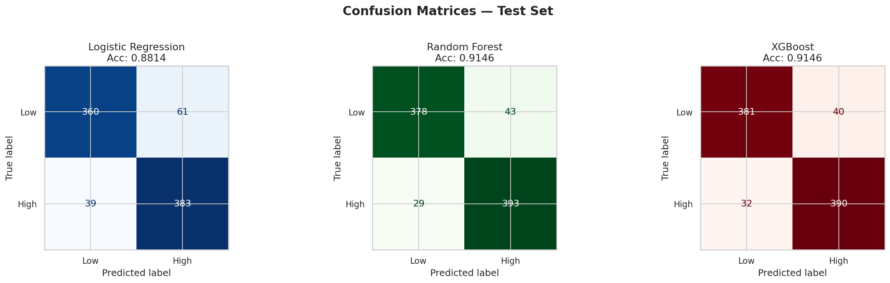

### ROC Curve Comparison
All three models achieve excellent AUC scores (>0.96). XGBoost has the highest AUC at 0.975.

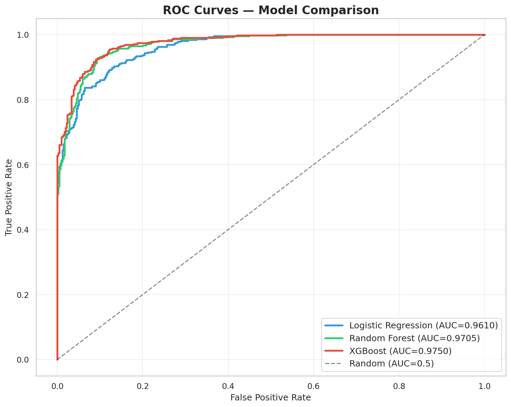

### Feature Importance
The most important features for predicting yield class:
1. **Seasonal Temperature Amplitude** — by far the strongest predictor
2. **Drought Stress Index** — the rainfall-to-temperature ratio
3. **Regional features** — especially Karadeniz, Doğu Anadolu, and Marmara

This confirms that structural climate characteristics and geographic location matter more than year-to-year weather fluctuations.

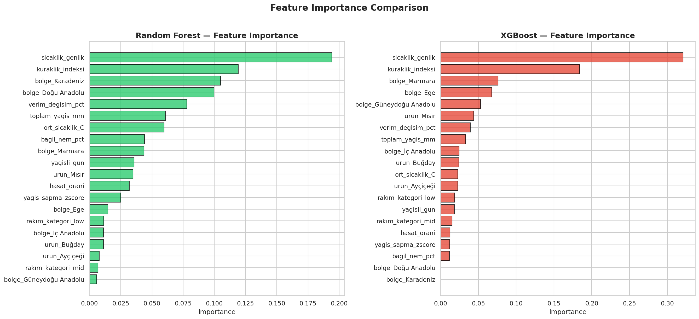

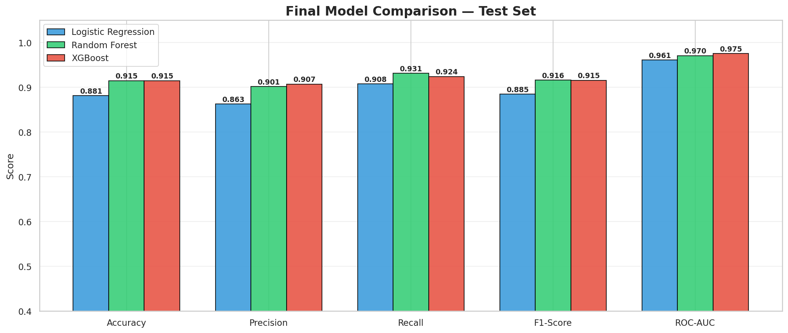

---

## Key Findings

1. **Tree-based models significantly outperform linear models** — RF and XGBoost achieve ~91.5% accuracy vs. 88.1% for Logistic Regression, confirming non-linear weather-yield relationships.

2. **Geographic region is the strongest structural predictor** — Akdeniz and Marmara produce higher yields; Doğu Anadolu the lowest.

3. **Drought stress index is the most important weather-derived feature** — validating the enrichment strategy from the proposal.

4. **Excessive rainfall hurts yields** — contrary to intuition, above-average rainfall correlated with lower wheat yields.

## Limitations
- Province-level annual averages are coarse; sub-annual or district-level data would improve predictions
- Additional features like irrigation coverage, fertilizer usage, and soil composition could improve performance

## Repository Structure
```
├── DATA/                        → Dataset (CSV)
├── EDA/                         → Exploratory Data Analysis (notebook + figures)
├── HypothesisTesting/           → Statistical tests (notebook + figures)
├── MachineLearning/             → ML models (notebook + figures)
├── FinalReport.ipynb             → Final report
├── dataCleaning.ipynb           → Data collection & cleaning
├── requirements.txt
├── AI_USAGE.md                  → AI tool disclosure
├── proposal.pdf                 → Project proposal
└── README.md
```

## How to Run
```bash
pip install pandas numpy scipy scikit-learn xgboost matplotlib seaborn
```
Run notebooks in order: dataCleaning.ipynb → EDA/eda.ipynb → HypothesisTesting/hypothesis_tests.ipynb → MachineLearning/ml_classification.ipynb

## AI Tool Disclosure
This project used Claude (Anthropic) for code generation support. Full details in [AI_USAGE.md](AI_USAGE.md).
